# 🏗️ ConstructEYE

<p align="center">
  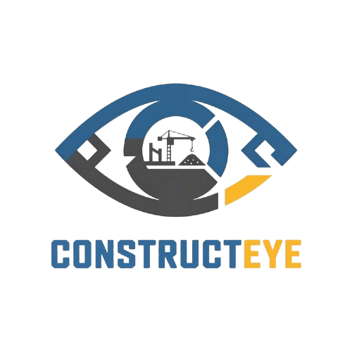
</p>

**ConstructEYE** is a full-stack construction site monitoring platform developed as a **teamwork project**. It pairs a **Flutter mobile app** with an **edge-AI stack** on **Raspberry Pi 5 + Hailo-8** for real-time safety monitoring, progress reporting, and cloud sync via Firebase.

The mobile app follows **Clean Architecture** and a **feature-first structure**, integrating Firebase services, live MJPEG streaming, PDF reporting, and push notifications. The edge module runs on-site for PPE/fall/idle detection and AI-driven construction progress analysis.

---

## 📌 Project Description

ConstructEYE allows users to authenticate with role-based access, monitor construction sites through live MJPEG camera streams, receive real-time violation alerts, generate and view construction reports in PDF format, manage multiple projects, and update user profiles.

Construction site locations and violations are tracked with detailed analytics and visual charts to enhance decision-making and improve site safety compliance.

The backend integrates with **Firebase** (Authentication, Firestore, Storage, Cloud Messaging) providing RESTful-like services for user management, project tracking, violation detection, and notifications.

To improve performance and provide offline capabilities, the app implements **local data persistence** using **Hydrated BLoC** and **Shared Preferences**.

The project emphasizes:
* Clean code
* Separation of concerns
* Scalability
* Team collaboration

---

## 👥 Team Members

This project was developed collaboratively by:

## Team Members

| Name | Role | GitHub |
|--------|--------|---------|
| Mohamed Yasser | Flutter Developer | https://github.com/midoyasser16204 |
| Youssef Salah | Flutter Developer | https://github.com/YousefSalah1 |
| Yassin Hussen | Flutter Developer | https://github.com/yassinmekky |
| Youssef Hassan | AI Developer | https://github.com/loxrobby |
| Youssef Mohamed | AI Developer | https://github.com/youssefabdelkhalek1 |
| Youssef Halawa | Backend Developer (Django) | https://github.com/Ussef-Halawa |
| Aisha Nagah | Backend Developer (Django) | https://github.com/Aisha-Nagah |

---

## ✨ Features Overview

* 🔐 Authentication (Email/Password & Role Selection)
* 🏗️ Project Management & Switching
* 📹 Live Camera Streaming (MJPEG)
* 🚨 AI-Powered Violation Detection & Alerts
* 📊 AI Construction Reports with Progress Analysis
* 🌤️ Real-time Weather Integration
* 🔔 Push Notifications & Deep Linking
* 👤 User Profile Management
* � Real-time Notification Updates
* 💾 State Persistence & Offline Support
* 🌍 Multi-language (English/Arabic) with RTL

---

## 📸 Screenshots

### 🚀 Splash

<table>
  <tr>
    <td align="center">
      <b>Splash Screen</b><br><br>
      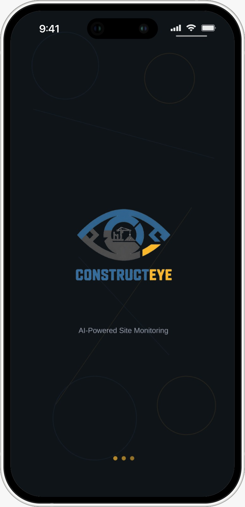
    </td>
  </tr>
</table>

---

### 🔐 Authentication  & Role Selection

<table>
  <tr>
    <td align="center">
      <b>Login</b><br><br>
      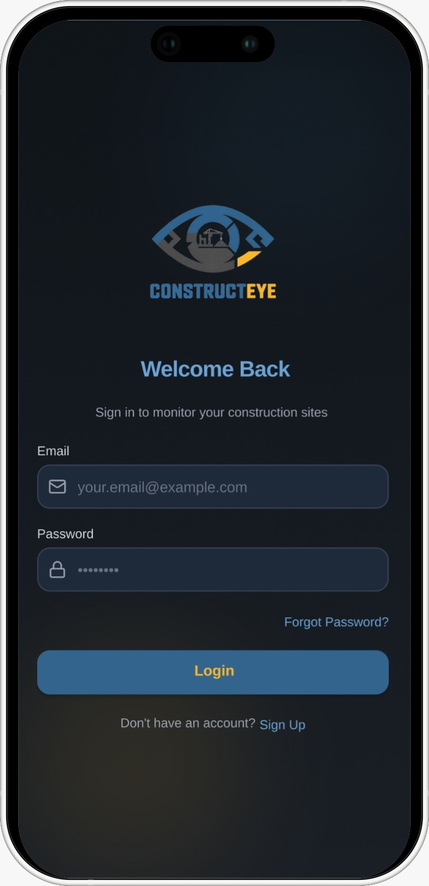
    </td>
    <td align="center">
      <b>Sign Up</b><br><br>
      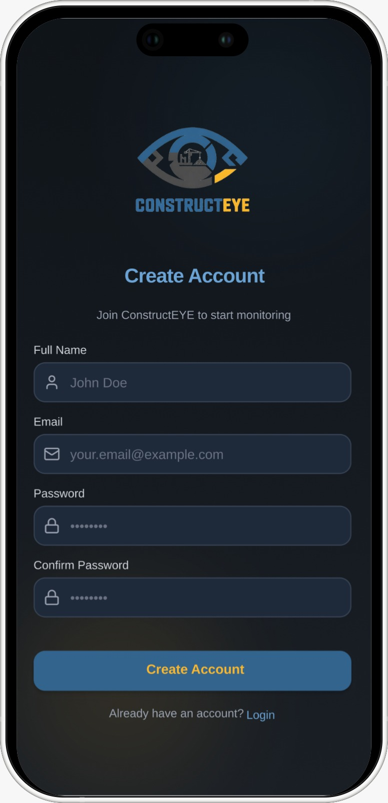
    </td>
  </tr>
  <tr>
    <td align="center">
      <b>Forget Password</b><br><br>
      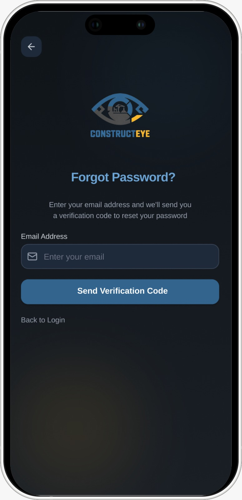
    </td>
    <td align="center">
      <b>Select Role</b><br><br>
      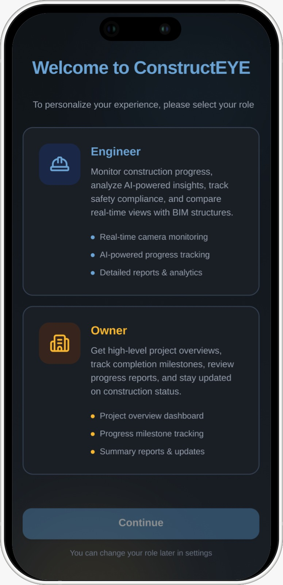
    </td>
  </tr>
</table>

---

### 🏗️ Home & Projects

<table>
  <tr>
    <td align="center">
      <b>Home Dashboard</b><br><br>
      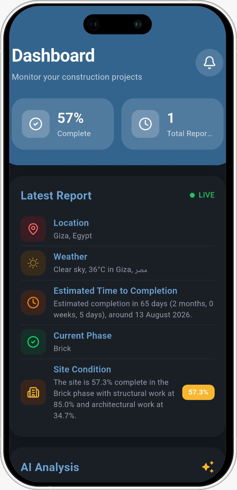
    </td>
    <td align="center">
      <b>Projects</b><br><br>
      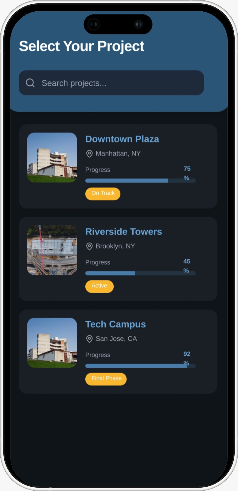
    </td>
  </tr>
</table>

---

### 📹 Live Monitoring

<table>
  <tr>
    <td align="center">
      <b>Live Camera Stream</b><br><br>
      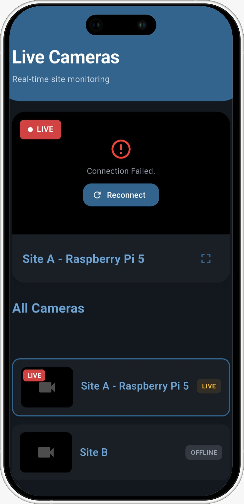
    </td>
    <td align="center">
      <b>Violation Details</b><br><br>
      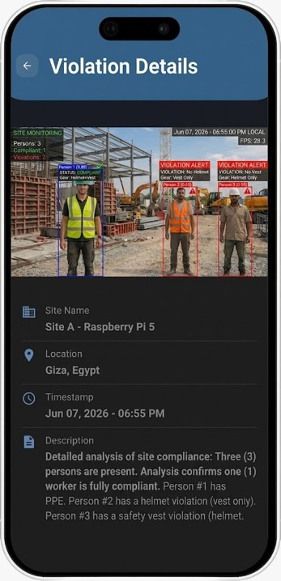
    </td>
  </tr>
</table>

---

### 🤖 Edge AI Hardware

<table>
  <tr>
    <td align="center">
      <b>Deployed Edge Device</b><br><br>
      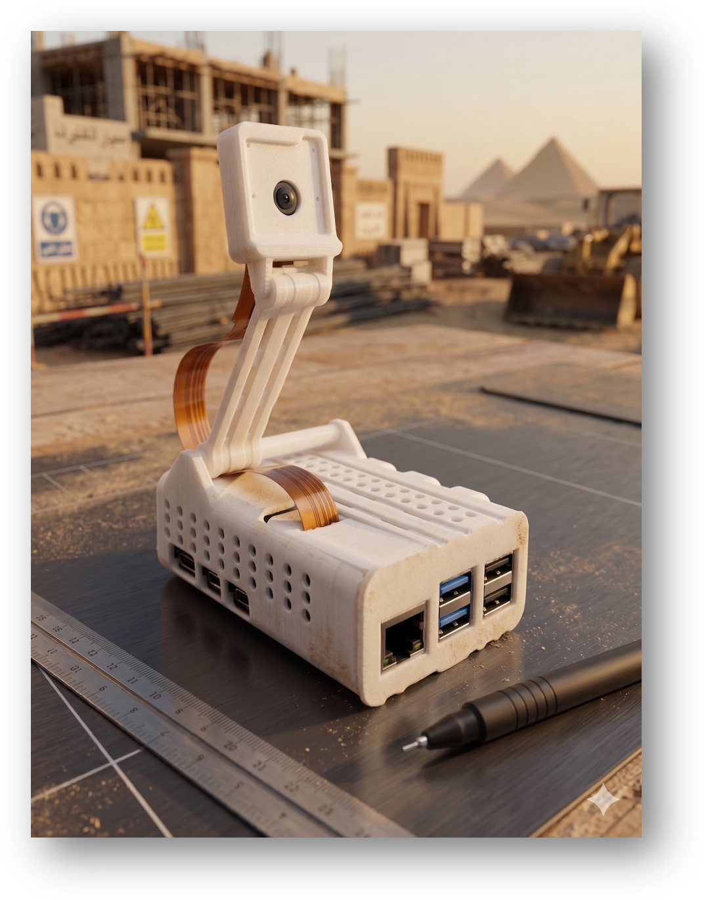
    </td>
  </tr>
</table>

<p align="center"><em>Raspberry Pi 5 + Hailo-8 AI HAT with site camera — powers live MJPEG streaming, PPE detection, and progress reporting</em></p>

---

### 📊 Reports

<table>
  <tr>
    <td align="center">
      <b>Reports List</b><br><br>
      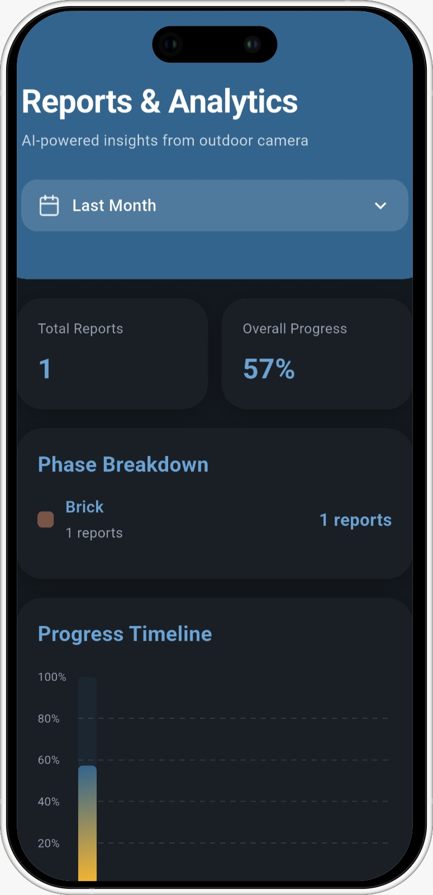
    </td>
    <td align="center">
      <b>PDF Viewer</b><br><br>
      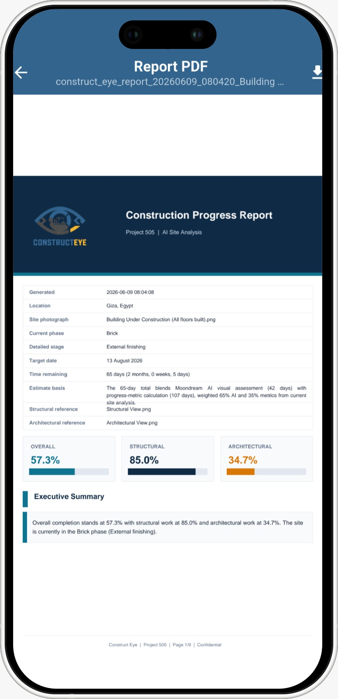
    </td>
  </tr>
</table>

---

### 🔔 Notifications

<table>
  <tr>
    <td align="center">
      <b>Notifications</b><br><br>
      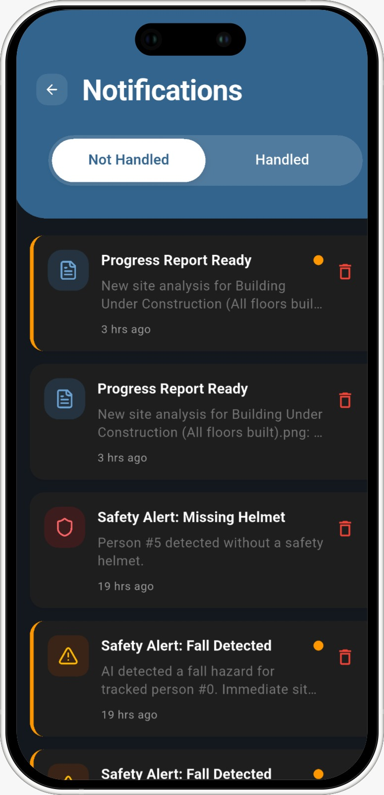
    </td>
  </tr>
</table>

---

### 👤 Profile

<table>
  <tr>
    <td align="center">
      <b>Profile</b><br><br>
      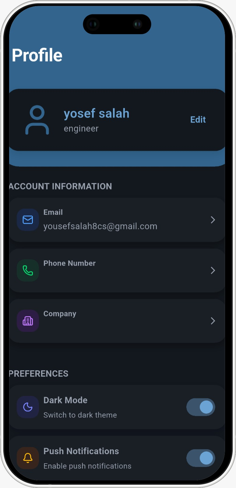
    </td>
    <td align="center">
      <b>Edit Profile</b><br><br>
      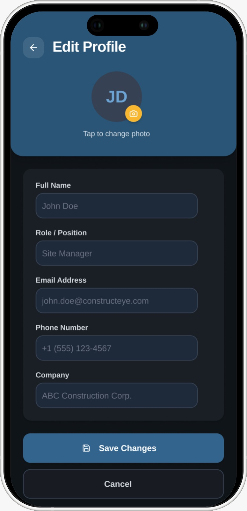
    </td>
  </tr>
</table>

---

<br>

## 🔐 Authentication Features

* Email & password authentication
* Firebase Authentication integration
* Role-based access control (Owner, Engineer)
* Role selection after registration
* Password reset via email
* Secure form validation
* Persistent authentication state

---

## 🏗️ Home Dashboard Features

* Real-time construction progress overview
* Overall project completion percentage
* Total reports counter
* Latest report summary with live status
* Current project location display
* Real-time weather conditions integration
* Estimated time to completion
* Current construction phase tracking
* Site condition summary with progress badge
* AI-powered analysis insights
* Target design overview
* Overall progress visualization
* All reports history in card view

---

## 📋 Project Management Features

* View all available construction projects
* Switch between multiple projects
* Project-specific data isolation
* Active project tracking
* Project details and information

---

## 📹 Live Monitoring Features

* Real-time MJPEG video streaming
* Multi-camera support
* Live camera feed from construction sites
* Device-based camera management
* Continuous site surveillance

---

## 🚨 Violation Detection Features

* AI-powered safety violation detection
* Real-time violation alerts
* Violation details with evidence images
* Missing safety equipment detection (PPE tracking)
* Fall detection monitoring
* Idle worker time tracking
* Person identification system
* Violation status tracking
* Location-based violation mapping
* Timestamp and datetime recording

---

## 📊 Construction Reports Features

* AI-generated construction progress reports
* PDF report generation and viewing
* Architectural progress analysis
* Structural progress analysis
* Site condition assessment
* Progress percentage tracking
* Reference image comparison
* Detailed phase descriptions
* Estimated completion date calculations
* Progress breakdown by category
* AI-powered site vs target comparison
* Report history and filtering
* PDF download and offline viewing

---

## 🔔 Notification Features

* Firebase Cloud Messaging push notifications
* Real-time notification updates
* Notification history with read/unread status
* Violation alerts
* Report generation alerts
* Deep linking to violation details and PDF reports
* Notification badge on home screen
* Handle status tracking
* Per-user read status
* Foreground, background, and terminated state handling

---

## 👤 Profile Features

* View user information
* Edit profile details
* Upload profile picture
* Update full name, phone, company
* Role and project assignment display
* Notification settings management
* Push notification toggle
* Safety alerts toggle
* Theme customization (Dark/Light mode)
* Language selection (English/Arabic with RTL)
* Account logout

---

## 🛠️ Tech Stack

### 📱 Frontend (Mobile)

* Flutter (Dart) - SDK ^3.9.2
* State Management: BLoC / Cubit
* Networking: Dio
* Dependency Injection: get_it
* Architecture: Clean Architecture
* Video Streaming: MJPEG View
* Charts: FL Chart
* PDF Viewing: flutter_pdfview

---

### 💾 Persistence & Storage

* Hydrated BLoC – Persistent state management
* Shared Preferences – Key-value storage
* Path Provider – File system access
* Custom State Persistence:
  * Persist theme preferences
  * Persist language preferences
  * Persist authentication state
  * Active project tracking
  * Improve app startup performance

---

### 🔥 Backend & Services

* Firebase Authentication – User authentication
* Cloud Firestore – Real-time database
* Firebase Storage – Image and PDF storage
* Firebase Cloud Messaging – Push notifications
* Flutter Local Notifications – Local notification display
* Weather API Integration – Real-time weather data

---

### 🤖 Edge AI (Raspberry Pi 5)

* Python 3 — Safety monitoring & progress reporting on Pi 5 + Hailo-8
* HailoRT / YOLOv8 — PPE detection (helmet, vest) on NPU
* MediaPipe — Fall detection via pose estimation
* Moondream Vision API — Structural/architectural progress analysis
* MJPEG streaming — Live site dashboard consumed by the mobile app
* OpenCV, fpdf2, firebase-admin — Capture, PDF generation, cloud sync

See [`edge-rpi5-site-monitoring/README.md`](edge-rpi5-site-monitoring/README.md) for deployment instructions.

---

## 🧱 Architecture Overview

The project follows a **Feature-Based Clean Architecture** approach.

Each feature is isolated and divided into **Data**, **Domain**, and **Presentation** layers.

---

### 📁 Feature Structure

```
feature_name/
├── data/
│   ├── datasources/
│   ├── models/
│   └── repositories/
├── domain/
│   ├── entities/
│   ├── repositories/
│   └── usecases/
└── presentation/
    ├── screens/
    ├── components/
    └── bloc/
```

---

### 🔁 Layer Responsibilities

**Data Layer**
* Handles Firebase and API requests
* Maps raw data into domain entities
* Implements repository contracts

**Domain Layer**
* Pure business logic
* Independent from Flutter & external libraries

**Presentation Layer**
* UI & user interaction
* State management using BLoC/Cubit

---

## 📂 Core Module

```
core/
├── blocs/          # Global BLoC (Theme, Language)
├── configures/     # Firebase configuration
├── constants/      # App constants
├── services/       # Notification services
├── themes/         # Light & Dark themes
├── shimmer/        # Loading skeletons
└── utils/          # Helper functions
```

---

## 📂 Full Repository Structure

ConstructEYE is a **monorepo** with two main parts: the Flutter client at the repo root and the Python edge stack under `edge-rpi5-site-monitoring/`.

```
construct-EYE/
├── README.md                          # This file — project overview
├── pubspec.yaml                       # Flutter app dependencies
├── lib/                               # Flutter mobile app (Clean Architecture)
├── android/ / ios/ / assets/ / images/  # Mobile platform & UI assets
│
└── edge-rpi5-site-monitoring/       # Raspberry Pi 5 + Hailo-8 edge AI stack
    ├── README.md                      # Edge module quick start & deployment guide
    ├── requirements.txt               # Python dependencies
    ├── config.example.env             # Environment template (copy → .env)
    │
    ├── shared/                        # Shared Firebase helpers (both modules)
    │   └── firebase_common.py         # Device registration, FCM, weather, notifications
    │
    ├── safety-monitoring/             # Real-time PPE, fall, idle detection + MJPEG stream
    │   ├── site_safety_monitor/
    │   │   └── site_safety_monitor.py # Main safety pipeline entry point
    │   ├── models/                    # YOLOv8 PPE weights (HEF, PT, ONNX) + training artifacts
    │   └── output/                    # Runtime violation snapshots & JSON logs
    │
    ├── progress-reporting/            # Moondream AI progress analysis + PDF reports
    │   ├── src/
    │   │   ├── construction_progress_report.py  # CLI report generator
    │   │   └── progress_report_gui.py           # Tkinter live progress window
    │   └── output/                  # Generated PDFs & reference metrics cache
    │
    ├── sample-site-images/            # Reference drawings + site photos for reports
    └── assets/                        # Logo, branding, and hardware photos
```

| Path | Role |
|------|------|
| `lib/` | Flutter mobile app — authentication, live stream, violations, reports, notifications |
| `edge-rpi5-site-monitoring/shared/` | Common Firebase/FCM code used by safety and progress modules |
| `edge-rpi5-site-monitoring/safety-monitoring/` | On-site PPE, fall, and idle detection with MJPEG dashboard (port 8081) |
| `edge-rpi5-site-monitoring/progress-reporting/` | AI construction progress reports synced to Firebase Storage/Firestore |
| `edge-rpi5-site-monitoring/sample-site-images/` | Input images for progress report generation |
| `edge-rpi5-site-monitoring/assets/` | Branding and device documentation images |

For edge deployment, setup, and CLI usage, see [`edge-rpi5-site-monitoring/README.md`](edge-rpi5-site-monitoring/README.md).

---

## 📂 Flutter App Structure

```
lib/
├── core/
│   ├── blocs/
│   ├── configures/
│   ├── constants/
│   ├── services/
│   ├── shimmer/
│   └── themes/
├── di/
│   └── DependencyInjection.dart
├── feature/
│   ├── data/
│   │   ├── datasources/
│   │   ├── models/
│   │   └── repositories/
│   ├── domain/
│   │   ├── entities/
│   │   ├── repositories/
│   │   └── usecases/
│   └── presentation/
│       ├── components/
│       ├── navigation/
│       └── screens/
│           ├── splash_screen/
│           ├── login_screen/
│           ├── signup_screen/
│           ├── select_role_screen/
│           ├── home_screen/
│           ├── projects_screen/
│           ├── live_stream_screen/
│           ├── reports_screen/
│           ├── violation_detail_screen/
│           ├── notification_screen/
│           ├── profile_screen/
│           ├── edit_profile_screen/
│           └── pdf_viewer_screen/
├── l10n/
│   ├── intl_en.arb
│   └── intl_ar.arb
└── main.dart
```

---

## 🚧 Future Enhancements

* 📍 Real-time GPS tracking for workers
* 💳 Payment integration for equipment rentals
* 🔔 SMS notifications for critical alerts
* 🌍 Additional language support
* 🤖 Predictive analytics and forecasting
* 📹 Video recording and playback
* 👷 Worker attendance with geofencing
* 📦 Material and inventory management
* 📈 Advanced analytics dashboards
* 🏗️ BIM (Building Information Modeling) integration

---

## ⭐ Acknowledgment

Thanks to all team members for their collaboration and effort in building this project.

We would like to express our sincere gratitude to **Dr. Hussam Elbehiery** and **Dr. Mohamed Eassa** for their continuous guidance and supervision throughout this project. We also extend our appreciation to **Eng. Ahmed Ali** and **Eng. Zeinab Atef** for their support and assistance during the development process. Special thanks to **Eng. Ahmed Kamal**, our Civil Engineering Specialist, for providing the domain expertise and technical insights that greatly contributed to the success of this project.

If you find this project useful, please consider giving it a **star ⭐**.
